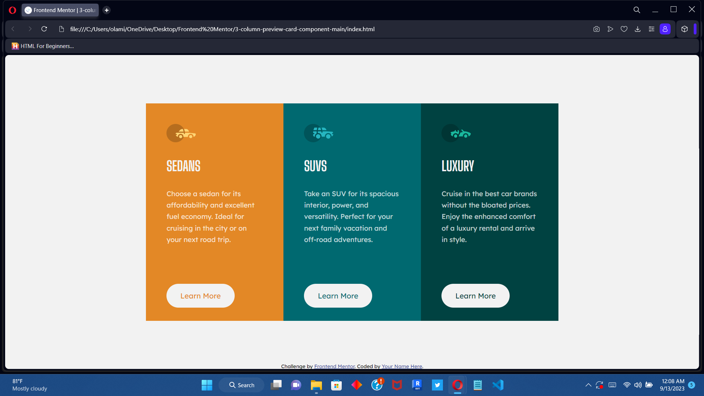

# Frontend Mentor - 3-column preview card component solution

This is a solution to the [3-column preview card component challenge on Frontend Mentor](https://www.frontendmentor.io/challenges/3column-preview-card-component-pH92eAR2-). Frontend Mentor challenges help you improve your coding skills by building realistic projects. 

## Table of contents

- [Overview](#overview)
  - [The challenge](#the-challenge)
  - [Screenshot](#screenshot)
  - [Links](#links)
- [My process](#my-process)
  - [Built with](#built-with)
  - [What I learned](#what-i-learned)
  - [Continued development](#continued-development)
  - [Useful resources](#useful-resources)
- [Author](#author)


## Overview

### The challenge

Users should be able to:

- View the optimal layout depending on their device's screen size
- See hover states for interactive elements

### Screenshot




### Links

- Solution URL: [Add solution URL here](https://your-solution-url.com)
- Live Site URL: [Add live site URL here](https://your-live-site-url.com)

## My process

### Built with

- Semantic HTML5 markup
- CSS custom properties
- Flexbox
- CSS Grid
- Media Query


### What I learned

- Using flexbox for layout and flex direction property
- Using theoverflow property to define the edges on a child element
- Using media query to create a fairly responsive layout

To see how you can add code snippets, see below:
```css
 @media (max-width: 900px){
  .section{
    flex-direction: column;
    width: min-content;
    border-radius: 10px;
    overflow: hidden;
  }
```

### Continued development
- The flexbox seem apowerful tool which I'm still learning about
- Media Queries to create even more responnsive layout
- Min-width, max-width, 

### Useful resources

- [Kevin Powell Youtube](https://www.youtube.com/@KevinPowell) - This helped me learn about flexbox and how to go about using it. I really liked this pattern and will use it going forward.
- [Learn CSS](https://web.dev/learn/css/flexbox) - This is an amazing article which helped me finally understand flexbox. I'd recommend it to anyone still learning this concept.

## Author

- Website - [Genii](https://www.your-site.com)
- Frontend Mentor - [Genii](https://www.frontendmentor.io/profile/Genii-X)
- Twitter - [Genii](https://www.twitter.com/@mild_mide)

